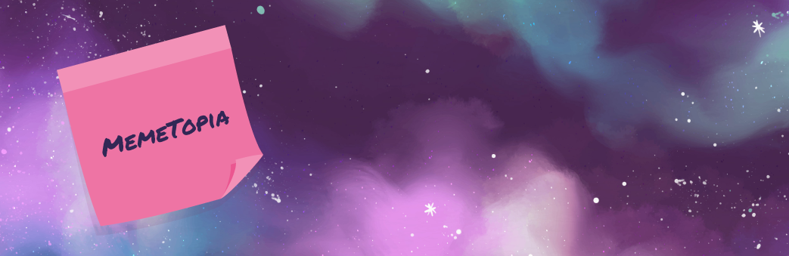

# MEMETOPIA

## 🕹 [Play the Game!](https://ana-badolato.github.io/MemeTopia/)

## 🗒️ Description

**Memetopia** is a fast-paced game where you climb an endless tower while battling crazed memes. The goal is simple: **🤞survive as long as possible, 🤺 defeat enemies, and 💰collect Doge Coins** to boost your score. The game ends when time runs out, and your score is calculated based on the memes defeated, coins collected, and seconds survived.

#### 60 seconds? Enough time to make history... or crash and burn.

# ⚙️ Main Functionalities

- **Movement**:
  - The player moves left with `a` and right with `d`.
  - Jumping is done with `space` and follows a smooth parabolic trajectory.

- **Enemies**:
  - Different types of enemies, each with unique damage and health characteristics.
  - Enemies spawn on platforms and move in loops on them.
  - The player takes damage upon touching an enemy.

- **Platforms and Power-Ups**:
  - Platforms spawn sequentially on the left and right but in random positions within a range.
  - Power-ups, such as **Doge Coins** and health kits, float while descending and affect the player's health or coins.

- **Background and Visual Effects**:
  - The background has a **parallax** effect, giving the illusion of infinity.
  - Bullets follow a parabolic path and appear in random colors.
  - A red overlay appears on the screen when the player's health is low.
  - The timer shakes when time is running out.
  - The player shakes when taking damage, and enemies explode when they die.

- **Scoring**:
  - The score is calculated based on time survived, coins collected, and enemies defeated.

- **Music and Settings**:
  - Music can be toggled on or off within the game.

- **Local storage**:
  - The game saves and displays scores at the end of each match.

# 🛠️ Backlog Functionalities

- **Add shooting mechanics** for enemies.
- **Special power-ups** for the player.
- **Increase difficulty** as time progresses.
- **Improve the UI** for a better player experience.

# 🖥️ Technologies Used

- HTML
- CSS
- JavaScript
- DOM Manipulation
- JS Classes
- Local Storage
- JS Audio()

# 🚦States

- Start Screen
- Game Screen
- Game Over Screen
- Game Win Screen

# 🌍 Extra Links 

### Sketch
[Link](https://www.figma.com/board/YX3qS1F6pwj4kJQhPyBPYV/Memetopia-%2F-Concept?node-id=0-1&t=NXBovHe1RRAQ3v58-1)

### Trello
[Link](https://trello.com/invite/b/66b87f105af5fa236b579579/ATTI8146e3ad64efc50e338ad33014963c22AB029016/m01-final-project)

### Slides
[Link](www.your-slides-url-here.com)

# 🎮 Deploy
[Link](https://ana-badolato.github.io/MemeTopia/)

# 🤩 Special Thanks
### 🪄 Sala 12 (where the real magic happens)
### 🐈🐈‍⬛🧑‍🦰 To my family and cats for their patience